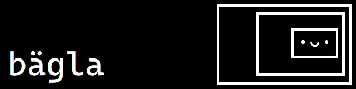

bägla is not really a game engine, just some useful extra things I find very useful when dealing with game development in SFML. Consider it as an other extension library, like [Thor](https://github.com/Bromeon/Thor) or [Heavy](https://github.com/xSnapi/Heavy).

The things that it provides (or will in the future)
- AssetManagment
- Simple GUI
- Map support for Tiled maps (with tmxlite)
- Physics system (with box2d) (even for maps)
- State manager
- Animations
- Particle system
- Lights (with box2d)

My open-source game in progress [Pitty-Putty](https://github.com/ekaktusz/pitty-putty) is a demonstration with it's capabilities.
